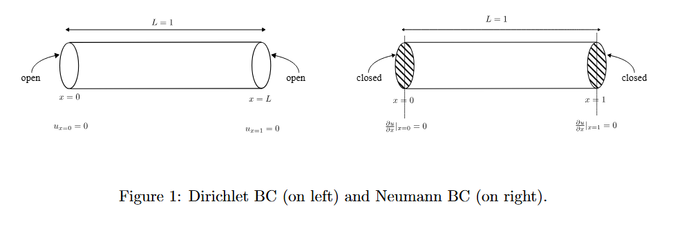
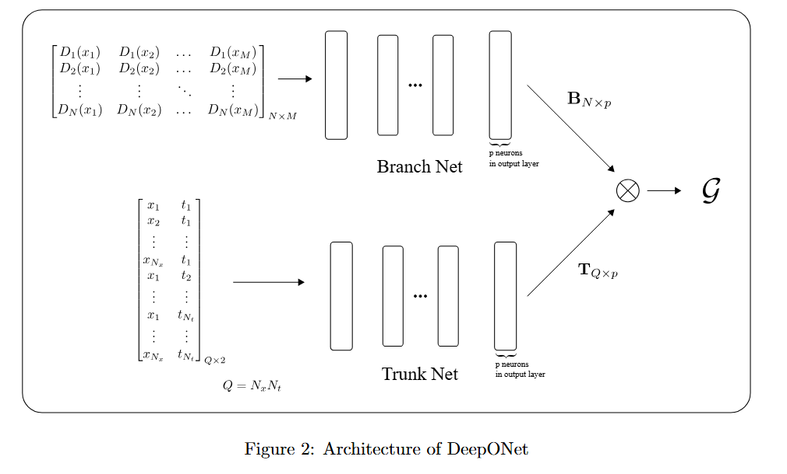
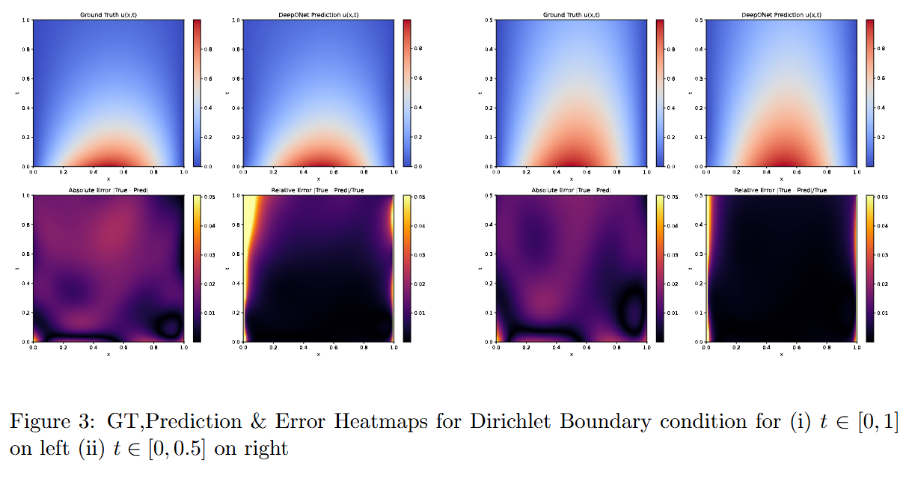
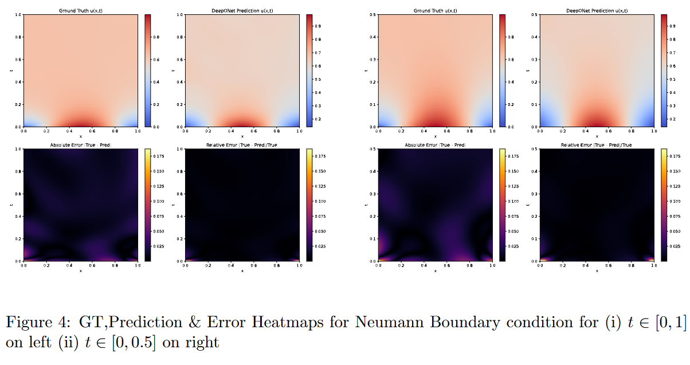

## Deep Operator Networks (DeepONet)

### Introduction

Standard MLPs are universal function approximator i.e. they're good at approximating functions ( that maps set of numbers to set of numbers).However, MLPs struggle to approximate operator (which maps function to function), partly due to Data structure and computation limitations. To approximate Operators, we use DeepONet, which is a universal operator approximator.

Here, We considered example of 1D diffusion with variable diffusion coefficient $D(x)$. We made a DeepONet network which takes $D(x)$ as input and output $u(x,t)$.

### 1D Diffusion equation

Fick's second law for variable diffusion coefficient is described as : 

$$
    \frac{\partial u}{\partial t} = \frac{\partial}{\partial x}\left[D \frac{\partial u}{\partial x}\right]
$$

where :
- $u=u(x,t)$ is concentration
- $D=D(x)$ is Diffusion coefficient varying with $x$

Using product rule, the above equation can be written as :

$$
    \frac{\partial u}{\partial t} = D \frac{\partial^2 u}{\partial x^2} + \frac{\partial D}{\partial x} \frac{\partial u}{\partial x}
$$

Now, in order to have a labelled dataset $D(x) \to u(x,t)$, we need to generate the function $D(x)$, and then solve for $u(x,t)$ for each $D(x)$. This is  discussed in upcoming sections.

### Defining the problem domain

We consider $x \in [0,1]$ and $t \in [0,1]$. We can think of it as 1D pipe spanning from $x=0$ to $x=1$ where concentration is being monitored.

### Generating D(x)

First of all, We will generate many diffusion functions $D_j(x)$, $j = 1,2,...,N$ where $N$ is total number of Dataset samples.

To acheive this, we will generate linear functions in $x \in [0,1]$ $s.t.$ its minimum value is $>m$ and its maximum value $< M$, where $m$ and $M$ some positive numbers $(M>m)$. Then, clearly

$$
\begin{equation*}
    D(x) = ax + b 
\end{equation*}
$$

Note that $D(0) \in [m,M]$ and $D(1) \in [m,M]$

$$
\begin{align*}
&\implies && b \in [m,M] \quad \text{and} \quad a+b \in [m, M] &&
\end{align*}
$$

Here, we generate a random linear fucntion $D(x)$ by generating coefficients $a$ and $b$ as follows:

$$
\begin{align*}
    b \sim U[m,M]
\end{align*}
$$ 

$$
\begin{align*}
    a \sim U[m-b,M-b]
\end{align*}
$$

Where $U$ is Uniform Random Distribution. 

## Boundary and Initial Conditions

For this problem, we define Initial condition as :

- Initial Condition :  $u(x,0) = sin(\pi x)$

and, there are two types of Boundary conditions

- 1. Dirichlet Boundary Conditions

We consider ends of this 1D pipe to be open. As a result, we get $u(x\text{=}0,t)=0$ and $u(x\text{=}1,t)=0$ $\forall t$.

- 2. Neumann Boundary Conditions

We consider ends of this pipe to be closed. As a result, we get $\frac{\partial u}{\partial x}\vert_{x=0}=0$ and $\frac{\partial u}{\partial x}\vert_{x=1}=0$.

## Solving for $u(x,t)$ using Finite Difference Method (FDM)

For each $D_j(x)$, we solve for $u_j(x,t)$ in equation $(2)$ using Finite Difference Method, Specifically FTCS.

Considering $N_x$ spatial grids and $N_t$ time grids, This gives us $u_j(x_p,t_q)$ with 

- $j=1,2,...,N$
- $p=1,2,...,N_x$
- $q=1,2,...,N_t$

This concentration Data (which we will consider ground truth for our experiment) can be expressed in matrix as 

$$
\begin{equation*}
    \mathbf{U_{true}} = 
    \begin{bmatrix} 
    u_1(x_1,t_1) & \dots & u_1(x_{N_x},t_1) & \dots &  u_1(x_{N_x},t_{N_t}) \\
    u_2(x_1,t_1) & \dots & u_2(x_{N_x},t_1) & \dots &  u_2(x_{N_x},t_{N_t}) \\
    \vdots & \vdots & \vdots & \ddots & \vdots \\
    u_N(x_1,t_1) & \dots & u_N(x_{N_x},t_1) & \dots &  u_N(x_{N_x},t_{N_t}) 
    \end{bmatrix}_{N \times Q}
\end{equation*}
$$

where $Q = N_x N_t$

## Architecture of DeepONet

DeepONet consists of Branch Net and Trunk Net, where Branch Net takes input functions and Trunk Net takes queries (position and time at which we want our output velocity).

Suppose for each function $D_j(x)$, we have $M$ sensors at $x=x_1,x_2,...,x_M$. Then we can write this input function as matrix as :

$$
\begin{equation*}
    \begin{bmatrix} 
    D_1(x_1) & D_1(x_2) & \dots & D_1(x_M) \\
    D_2(x_1) & D_2(x_2) & \dots & D_2(x_M) \\
    \vdots & \vdots & \ddots & \vdots \\
    D_N(x_1) & D_N(x_2) & \dots & D_N(x_M) 
    \end{bmatrix}_{N \times M}
\end{equation*}
$$

This goes to Branch Net. Because output layer has $p$ neurons, the shape of output matrix will be $N \times p$, we call it $\mathbf{B}_{N \times p}$.

Now, for Trunk Net, the input is set of queries written in matrix as (Here, $Q=N_xN_t$):

$$
\begin{equation*}
    \begin{bmatrix}
     x_1 & t_1 \\
     x_2 & t_1 \\
     \vdots & \vdots \\
     x_{N_x} & t_1 \\
     x_1 & t_2 \\
     x_2 & t_2 \\
     \vdots & \vdots \\
     x_1 & t_{N_t} \\
     \vdots & \vdots \\
     x_{N_x} & t_{N_t}
     \end{bmatrix}_{Q \times 2}
\end{equation*}
$$

The output layer of Trunk Net also has $p$ neurons and output is $\mathbf{T}_{Q \times p}$.

Finally, output from both Branch Net and Trunk Net are merged through operation dyadic product (outer product) $\otimes$ as 

$$
    \mathbf{U_{pred}} = \mathbf{BT}^\top + \mathbf{bias}
$$

with loss function defined as 

$$
    \mathcal{L}_\theta = \frac{1}{MN}\Vert\mathbf{U_{pred}} - \mathbf{U_{true}}\Vert_2^2
$$

By training this (\& hence minimising $\mathcal{L}$), we learn the parameters $\theta$ to learn operator $G_{\theta}$ such that $G_{\theta} \approx \mathcal{G}$ ,

 where $\mathcal{G}$ is such that $\mathcal{G}(D)(u) : \mathcal{A} \to \mathcal{U}$

Here $\mathcal{A}$ is input function space (Vector space of functions containing all possible input $D(x)$ functions) and $\mathcal{U}$ is output function space (vector space of output functions $u$).

## Results

We generated data and trained our model for both boundary conditions.

Model was trained on 800 instances of training data, each for Dirichlet and Neumann B.C. and was evaluted at 200 instances of test set data. It performed well with 3.98% relative error for Dirichlet B.C. and 2.56% relative error for Neumann B.C. (error metric being $E = \frac{\Vert U_{true} - U_{predicted}\Vert_2}{\Vert U_{true}\Vert_2}$ ).

Below is result for one of the 200 predictions on test set for each B.C.

